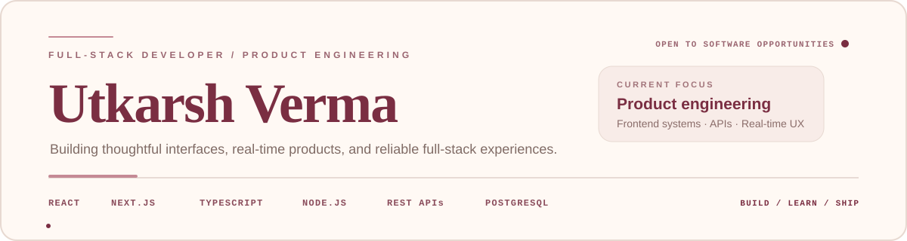

  

  

  
  
  

  <strong>Building polished web products with clean UI, real-time systems, and strong engineering fundamentals.</strong>

---

## 👋 About Me

I’m **Utkarsh Verma**, a final-year **B.Tech CSE** student and **Full-Stack Developer** focused on turning product ideas into clean, usable software.

- 💼 **Product Engineering Intern — Frontend**
- 🚀 Build responsive product interfaces with **React, Next.js, TypeScript, Tailwind CSS, and REST APIs**
- 🧩 Work on data-heavy UI, dashboards, tables, filters, charts, drawers, and real-time experiences
- 🧠 Practice **DSA in Java** and have solved **100+ LeetCode problems**
- ☁️ Growing deeper in **backend engineering, AWS, and scalable system design**
- 🎯 Open to **Software Engineer, Full-Stack, and Frontend** opportunities

> I like products that feel simple on the surface and are thoughtfully engineered underneath.

---

## 💼 Experience

### Product Engineering Intern — Frontend
**Production UI · Product flows · API integration · Quality**

- Convert product and Figma requirements into polished, responsive interfaces
- Build with **Next.js, React, TypeScript, and Tailwind CSS**
- Integrate typed REST APIs and data-heavy UI such as tables, filters, charts, and drawers
- Focus on component reuse, accessibility, responsive behavior, testing, and clean implementation

---

## 🚀 Selected Work

### 🎨 CanvasSync — Real-Time Collaborative Whiteboard
A full-stack whiteboard where multiple users can join shared rooms and draw together in real time.

**What it demonstrates:** WebSockets, event-driven architecture, synchronized room state, collaborator presence, undo ownership, reconnect handling, and export.

`React` `TypeScript` `Node.js` `Express` `Socket.IO` `HTML5 Canvas`

[Repository](https://github.com/utkarshverma-ai/CanvasSync_collaborative-whiteboard-mern) · [Live Demo](https://canvasync-livid.vercel.app/)

### ✅ ZenTask Manager — Project & Task Management Platform
A role-based team workspace with authentication, project/task workflows, assignments, priorities, due dates, metrics, and realtime refresh.

**What it demonstrates:** Supabase Auth, PostgreSQL RLS, CRUD flows, authorization, realtime data, dashboard UX, and responsive application design.

`React` `TypeScript` `Vite` `Supabase` `PostgreSQL` `RLS`

[Repository](https://github.com/utkarshverma-ai/ZenTask_Manager) · [Live Demo](https://zen-task-manager.vercel.app/)

### 🌐 Personal Portfolio — Interactive Developer Experience
A motion-rich portfolio built to present work through modern animation and 3D web techniques.

`React` `TypeScript` `GSAP` `Three.js` `WebGL`

[Repository](https://github.com/utkarshverma-ai/Utkarsh_Portfolio) · [Portfolio](https://utkarshportfolio-three.vercel.app/)

---

## 🛠️ Tech I Work With

  

---

## 🧠 Engineering Interests

`Real-time collaboration` · `Frontend architecture` · `Full-stack SaaS` · `REST APIs` · `Authentication & authorization` · `AI interfaces` · `Cloud fundamentals` · `System design`

---

## 🐍 Contribution Trail

  <picture>
    <source media="(prefers-color-scheme: dark)" srcset="https://raw.githubusercontent.com/utkarshverma-ai/utkarshverma-ai/output/github-snake-dark.svg" />
    <source media="(prefers-color-scheme: light)" srcset="https://raw.githubusercontent.com/utkarshverma-ai/utkarshverma-ai/output/github-snake.svg" />
    
  </picture>

---

## 🤝 Let’s Build Something Useful

I’m interested in engineering teams where I can contribute, learn fast, and ship real product work.

  
  
  

  <strong>Build useful things · learn the hard parts · keep shipping.</strong>

